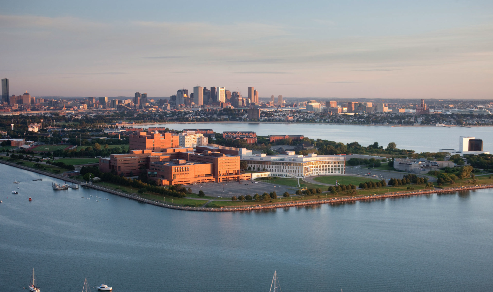

  <h2 style="color: #007BFF;">Do you know where to find the most powerful computers on UMass Boston's campus?</h2>

  
You can find us at <strong style="color: #007BFF;">AI Core Facilities</strong> — the central hub for cutting-edge research, scientific computing, and AI innovation at UMass Boston.

  

    The facility is led by <em><a href="https://www.linkedin.com/in/haehn" target="_blank" style="color: #007BFF; text-decoration: none;">Professor Daniel Haehn</a></em> (Director) and 
    <em><a href="https://www.linkedin.com/in/raminguyen" target="_blank" style="color: #007BFF; text-decoration: none;">Rami Huu Nguyen</a></em> (Deputy Director).
  

  

## What is AI Core?

  

    The AI Core provides infrastructure for machine learning on massive data collections, offers cutting-edge algorithms to accelerate AI research.
  

## What We Offer

  We offer specialized data management services , deliver targeted software development, and minimize the cost of manual data processing.

  

    
    

  

  

    
    

  

## Real-World Applications

  

    
  

  

    
  

  

    
  

  

    
  

## We specialize in:

  

    Virtual Assistants
  

  

    Pattern Recognition
  

  

    Recommendation Engines
  

  

    Fraud Detection
  

  

    Computer Vision
  

  

    Large Language Models
  

  

    Realtime Processing
  

  

    Scientific Simulations
  

## Our Equipments Showcase

  

    
    

  

  

    
    

  

  

    
    

  

  We are proudly located at the University of Massachusetts Boston, where innovation meets accessibility on the beautiful waterfront campus.

  <!-- First Row: 4 Images -->
  

    
  

  

    
  

  

    
  

  

    
  

  <!-- Second Row: 3 Images -->
  

    
  

  

    
  

  

    
  

  

  <strong>Interested in collaborating, accessing our facilities, or learning more about our work?</strong> 
  We welcome inquiries from researchers, startups, industry partners, and students.

  

    <strong>Daniel Haehn</strong> 
    Director, AI Core 
    Assistant Professor, Computer Science at UMass Boston 
    Contact: <a href="mailto:daniel.haehn@umb.edu" style="color: #007BFF;">daniel.haehn@umb.edu</a>
  

