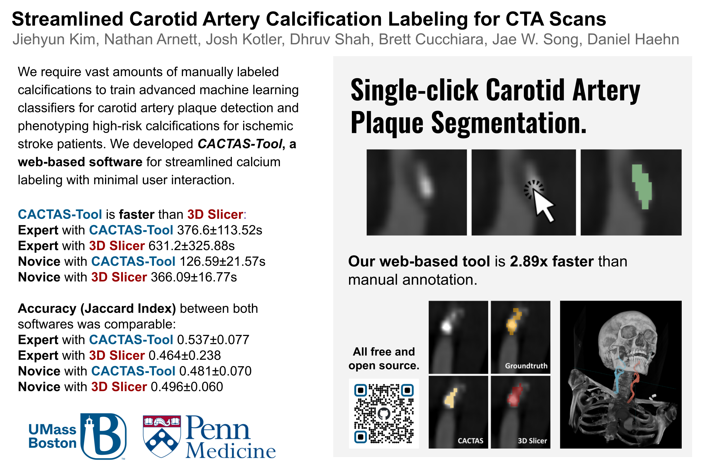
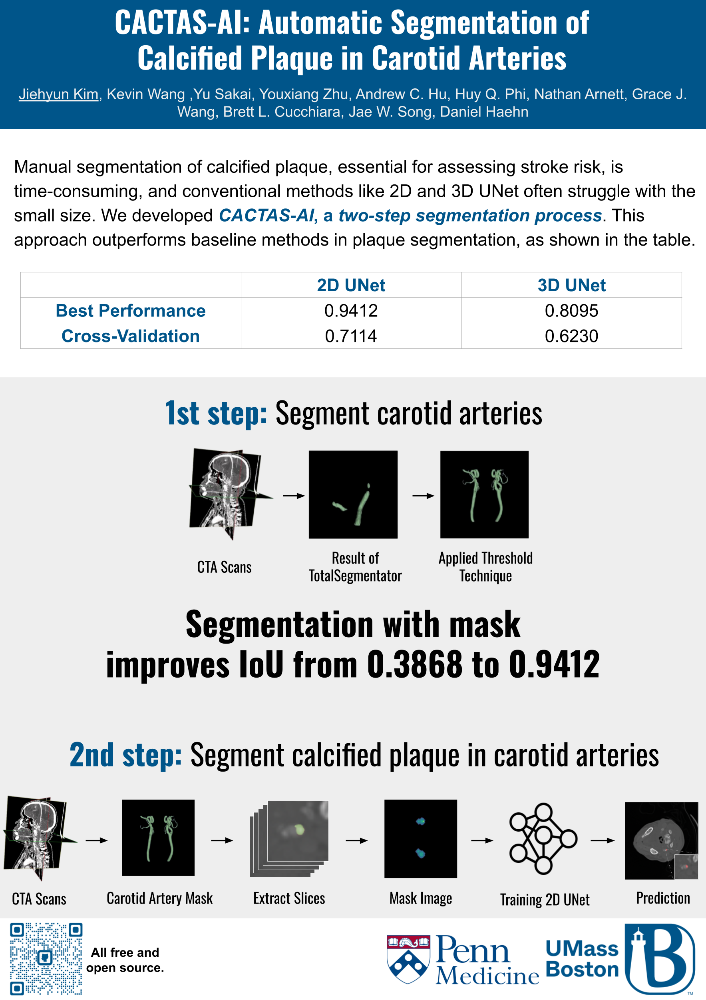
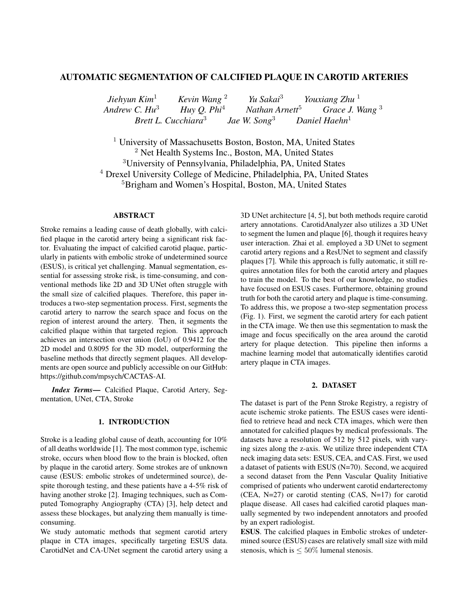
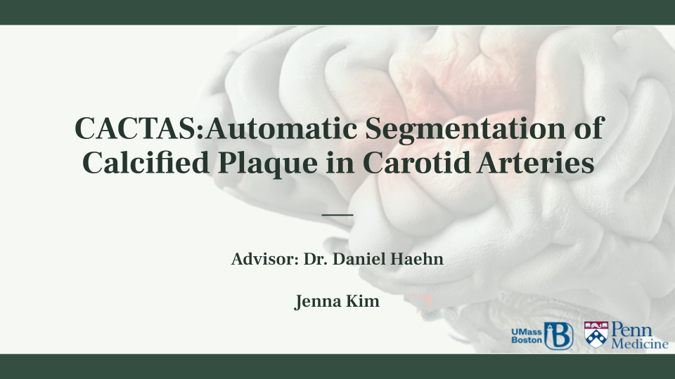

# Carotid Artery Computed Tomography Angiography Scoring (CACTAS)

CACTAS(Carotid Artery Computed Tomographic Angiography Scoring) project is an open-source project that can assist radiologists to diagnose an embolic stroke of undetermined source (ESUS).

## CACTAS-Tool
CACTAS-Tool is a web-based single-click annotation tool that is 2.89 times faster than manual segmentation. The abstract of the CACTAS-Tool is accepted by The Society of Cardiovascular Computed Tomography(SCCT).

## CACTAS-AI: Automatic Segmentation of Calcified Plaque in Carotid Arteries (ISBI 2025)
Manual segmentation of calcified plaque, essential for assessing stroke risk, is time-consuming, and conventional methods like 2D and 3D UNet often struggle with the small size. We developed CACTAS-AI, a two-step segmentation process. This approach outperforms baseline methods in plaque segmentation, as shown in the table. The paper of CACTAS-AI is accepted by the IEEE International Symposium on Biomedical Imaging (ISBI), 2025. 

You can check out the paper here:         

[Code available on github!](https://github.com/mpsych/CACTAS-AI)

This was presented at the 2024 CSM Showcase Research Presentation at the University of Massachusetts Boston.

&nbsp;&nbsp;&nbsp;

BibTex

<pre style="overflow:auto; text-align:left; font-size:0.8em;font-family:courier;margin-bottom: 20px;">@article{kim2023streamlined,
  title={Streamlined Carotid Artery Calcification Labeling For Cta Scans},
  author={Kim, J and Arnett, N and Kotler, J and Shah, D and Cucchiara, B and Song, J and Haehn, D},
  journal={Journal of Cardiovascular Computed Tomography},
  volume={17},
  number={4},
  pages={S54--S55},
  year={2023},
  publisher={Elsevier},
  doi={https://doi.org/10.1016/j.jcct.2023.05.136}
}</pre>

## Contact Us

For any inquiries, please email us at [kim@mpsych.org](mailto:kim@mpsych.org) or [team@mpsych.org](mailto:team@mpsych.org).
