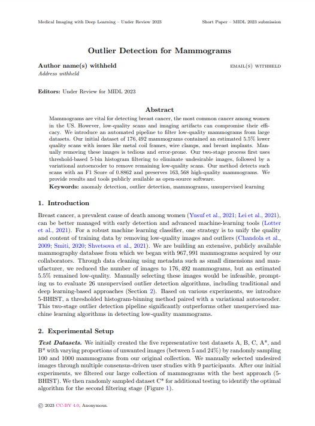
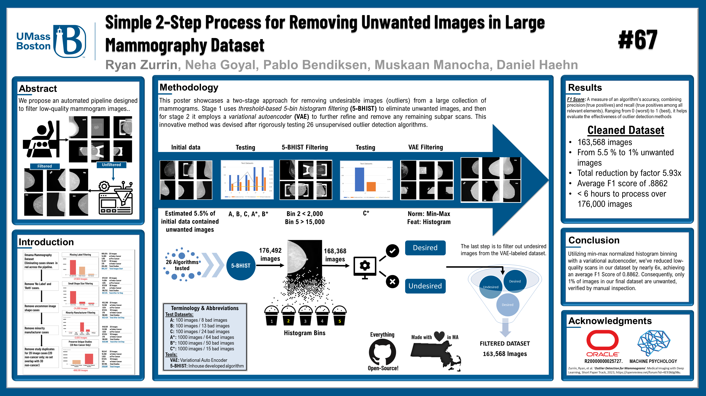

# The Oregon-Massachusetts Mammography Database (OMAMA-DB)

<!-- ## We are creating the World's largest Mammography Database.  -->

The OMAMA-DB contains thousands of breast cancer images with labels generated through a partnership with <a href='https://deep.health'>deep.health</a>.

## The dataset is now available at the <a href='https://dataverse.harvard.edu/dataverse/omama'>Harvard Dataverse</a>!

Supported by 

 

# Outlier Detection for Mammograms (MIDL 2023)

[Code available on github!](https://github.com/mpsych/ODM)

&nbsp;&nbsp;&nbsp;

BibTex

<pre style="overflow:auto; text-align:left; font-size:0.8em;font-family:courier;margin-bottom: 20px;">@inproceedings{zurrin2023outlier,
title={Outlier Detection for Mammograms},
author={Ryan Zurrin and Neha Goyal and Pablo Bendiksen and Muskaan Manocha and Dan Simovici and Nurit Haspel and Marc Pomplun and Daniel Haehn},
abstract={Mammograms are vital for detecting breast cancer, the most common cancer among women in the US. However, low-quality scans and imaging artifacts can compromise their efficacy. We introduce an automated pipeline to filter low-quality mammograms from large datasets. Our initial dataset of 176,492 mammograms contained an estimated 5.5% lower quality scans with issues like metal coil frames, wire clamps, and breast implants. Manually removing these images is tedious and error-prone. Our two-stage process first uses threshold-based 5-bin histogram filtering to eliminate undesirable images, followed by a variational autoencoder to remove remaining low-quality scans. Our method detects such scans with an F1 Score of 0.8862 and preserves 163,568 high-quality mammograms. We provide results and tools publicly available as open-source software.},
booktitle={International Conference on Medical Imaging with Deep Learning},
year={2023},
url={https://openreview.net/forum?id=4E93Xdg98u},
code={https://github.com/mpsych/ODM},
shortvenue={MIDL 2023}
}</pre>

# Press

- [Original News Article from UMass Boston](https://www.umb.edu/news/2020/two-umass-boston-researchers-awarded-mass-life-sci/)
- [MLSC Brief](https://www.masslifesciences.com/news/two-umass-boston-researchers-awarded-mass-life-sciences-grants/)

# Contact Us

For any inquiries, please email us at [team@mpsych.org](mailto:team@mpsych.org).
