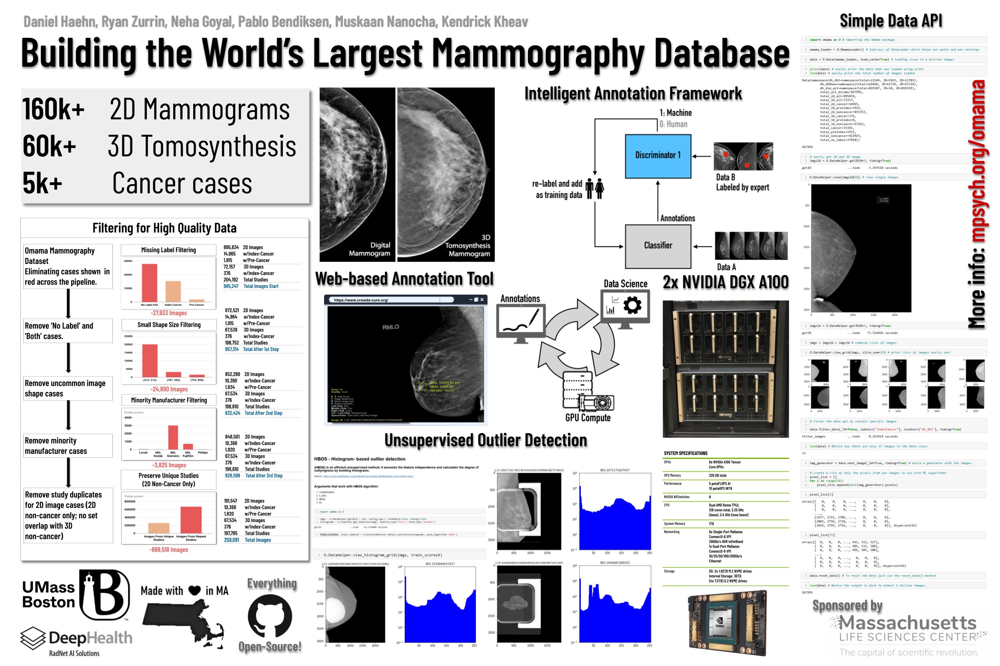
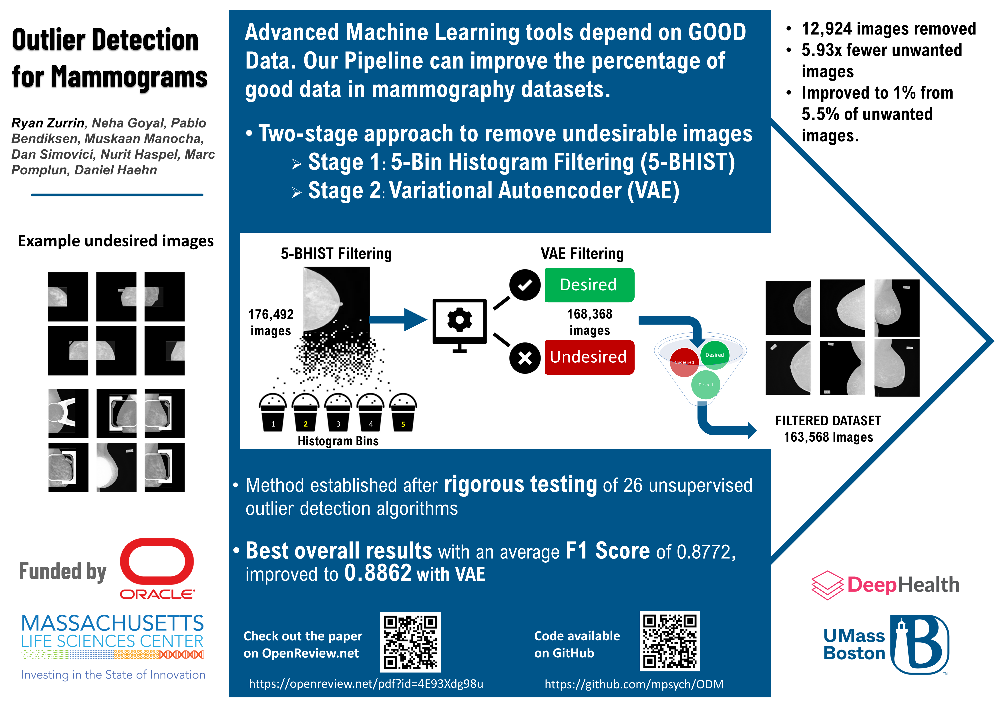

# Oregon-Massachusetts Mammography Database

<!-- ## We are creating the World's largest Mammography Database.  -->

## The data will be released in June 2023.

 <!-- Make sure to replace .pdf with .png -->

### Outlier Detection on Mammograms - MIDL 2023

- **Outlier Detection for Mammograms**  
  Ryan Zurrin, Neha Goyal, Pablo Bendiksen, Muskaan Manocha, Dan Simovici, Nurit Haspel, Marc Pomplun, Daniel Haehn  
  _Medical Imaging with Deep Learning, Short Paper Track, 2023_  
  [Paper Link](https://openreview.net/pdf?id=4E93Xdg98u) | [BibTeX](https://openreview.net/forum?id=4E93Xdg98u)

Check out our posters showcasing the outlier detection developed as part of the project.
Presented at MIDL and the 2023 CSM Student Success Showcase
 <!-- Make sure to replace .pdf with .png -->

## Press

- [Original News Article from UMass Boston](https://www.umb.edu/news/detail/two_umass_boston_researchers_awarded_mass_life_sciences_grants)
- [MLSC Brief](https://www.masslifesciences.com/news/two-umass-boston-researchers-awarded-mass-life_sciences_grants/)

## Contact Us

For any inquiries, please email us at [team@mpsych.org](mailto:team@mpsych.org).
