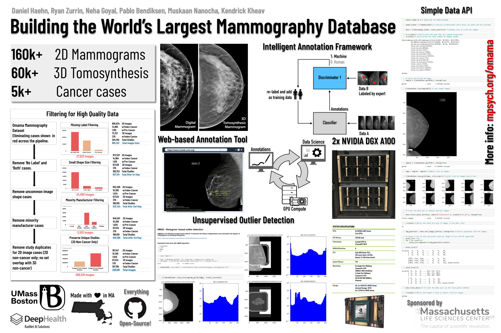
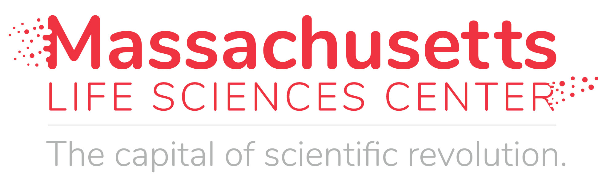
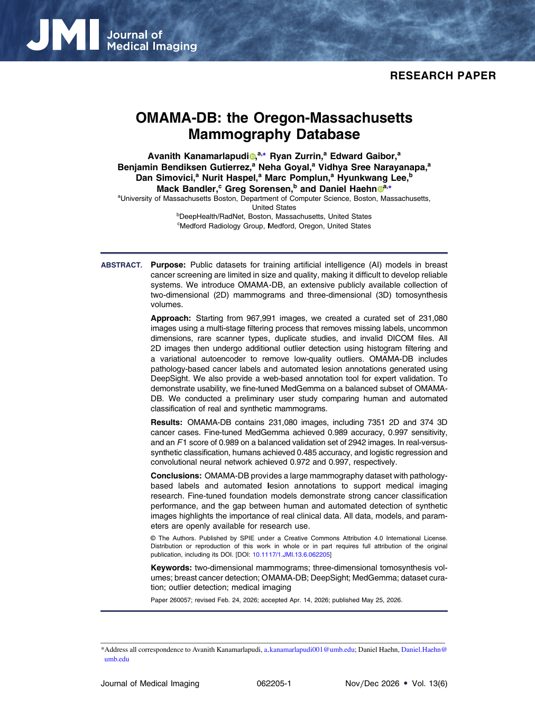
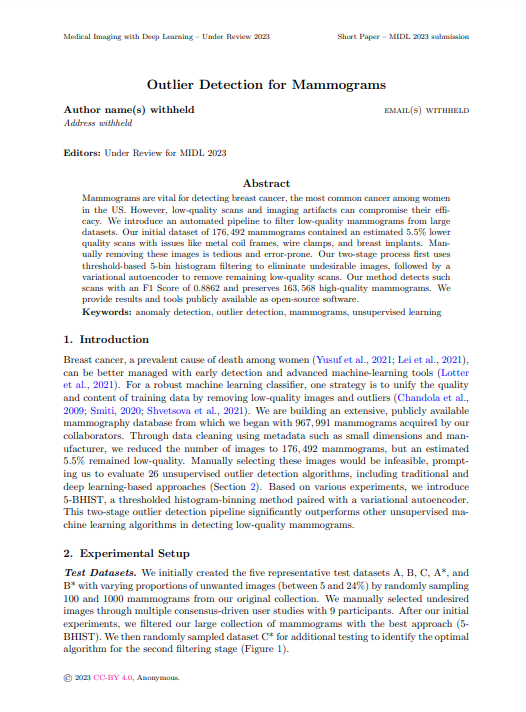
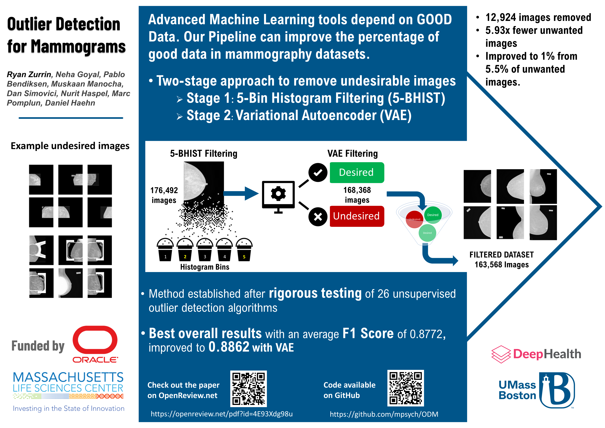
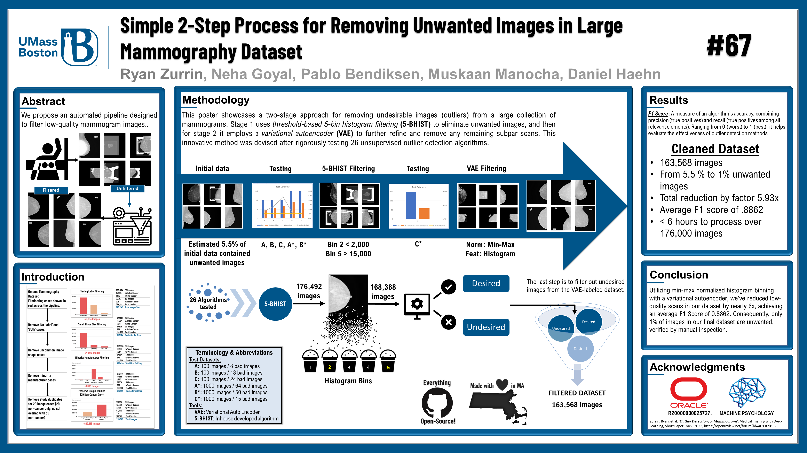

# The Oregon-Massachusetts Mammography Database (OMAMA-DB)

<!-- ## We are creating the World's largest Mammography Database.  -->

The OMAMA-DB contains thousands of breast cancer images with labels generated through a partnership with <a href='https://deep.health'>deep.health</a>.

## The dataset is now available at the <a href='https://dataverse.harvard.edu/dataverse/omama'>Harvard Dataverse</a>!

Supported by 

 

<h1>OMAMA-DB: the Oregon-Massachusetts Mammography Database (JMI 2026)</h1>

<h1>Outlier Detection for Mammograms (MIDL 2023)</h1>

 

BibTex

<pre style="overflow:auto; text-align:left; font-size:0.8em;font-family:courier;margin-bottom: 20px;min-height:295px;">@article{10.1117/1.JMI.13.6.062205,
  title={OMAMA-DB: the Oregon-Massachusetts Mammography Database},
  author={Avanith Kanamarlapudi and Ryan Zurrin and Edward Gaibor and Benjamin Bendiksen Gutierrez and Neha Goyal and Vidhya Sree Narayanapa and Dan Simovici and Nurit Haspel and Marc Pomplun and Hyunkwang Lee and Mack Bandler and Greg Sorensen and Daniel Haehn},
  journal={Journal of Medical Imaging},
  volume={13},
  number={6},
  pages={062205},
  year={2026},
  publisher={SPIE},
  doi={10.1117/1.JMI.13.6.062205},
  url={https://doi.org/10.1117/1.JMI.13.6.062205}
}</pre>

<pre style="overflow:auto; text-align:left; font-size:0.8em;font-family:courier;margin-bottom: 20px;min-height:295px;">@inproceedings{zurrin2023outlier,
  title={Outlier Detection for Mammograms},
  author={Ryan Zurrin and Neha Goyal and Pablo Bendiksen and Muskaan Manocha and Dan Simovici and Nurit Haspel and Marc Pomplun and Daniel Haehn},
  booktitle={International Conference on Medical Imaging with Deep Learning},
  year={2023},
  url={https://openreview.net/forum?id=4E93Xdg98u},
  code={https://github.com/mpsych/ODM}
}</pre>

 

[Code available on github!](https://github.com/mpsych/ODM)

&nbsp;&nbsp;&nbsp;

# Slides

<iframe src="https://slides.com/avanith/omama-db/embed" width="500" height="365" frameborder="0" webkitallowfullscreen mozallowfullscreen allowfullscreen></iframe>

# Press

- [Original News Article from UMass Boston](https://www.umb.edu/news/2020/two-umass-boston-researchers-awarded-mass-life-sci/)
- [MLSC Brief](https://www.masslifesciences.com/news/two-umass-boston-researchers-awarded-mass-life-sciences-grants/)

# Contact Us

For any inquiries, please email us at [team@mpsych.org](mailto:team@mpsych.org).
