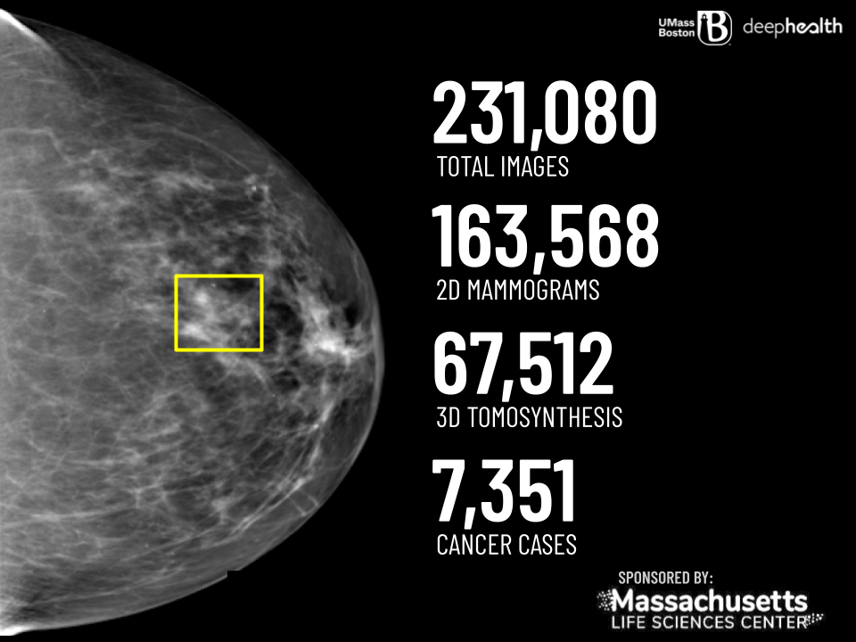

# The Oregon-Massachusetts Mammography Database (OMAMA-DB)

<!-- ## We are creating the World's largest Mammography Database.  -->

The OMAMA-DB contains thousands of breast cancer images with labels generated through a partnership with <a href='https://deep.health'>deep.health</a>.

## The dataset is now available at the !

<h1>OMAMA-DB: the Oregon-Massachusetts Mammography Database (JMI 2026)</h1>

<a href='/paper?kanamarlapudi2026omama'>Paper</a> | <a href='https://www.spiedigitallibrary.org/journals/journal-of-medical-imaging/volume-13/issue-06/062205/OMAMA-DB-the-Oregon-Massachusetts-Mammography-Database/10.1117/1.JMI.13.6.062205.full'>Website</a> | <a href='https://github.com/mpsych/ODM'>Code</a>

<h1>Outlier Detection for Mammograms (MIDL 2023)</h1>

<a href='/paper?zurrin2023outlier'>Paper</a> | <a href='https://openreview.net/forum?id=4E93Xdg98u'>Website</a> | <a href='https://github.com/mpsych/ODM'>Code</a>

 

&nbsp;&nbsp;&nbsp;

# Slides

<iframe src="https://slides.com/avanith/omama-db/embed" width="500" height="365" frameborder="0" webkitallowfullscreen mozallowfullscreen allowfullscreen></iframe>

# Press

- [Original News Article from UMass Boston](https://www.umb.edu/news/2020/two-umass-boston-researchers-awarded-mass-life-sci/)
- [MLSC Brief](https://www.masslifesciences.com/news/two-umass-boston-researchers-awarded-mass-life-sciences-grants/)

Supported by

# Contact Us

For any inquiries, please email us at [team@mpsych.org](mailto:team@mpsych.org).
