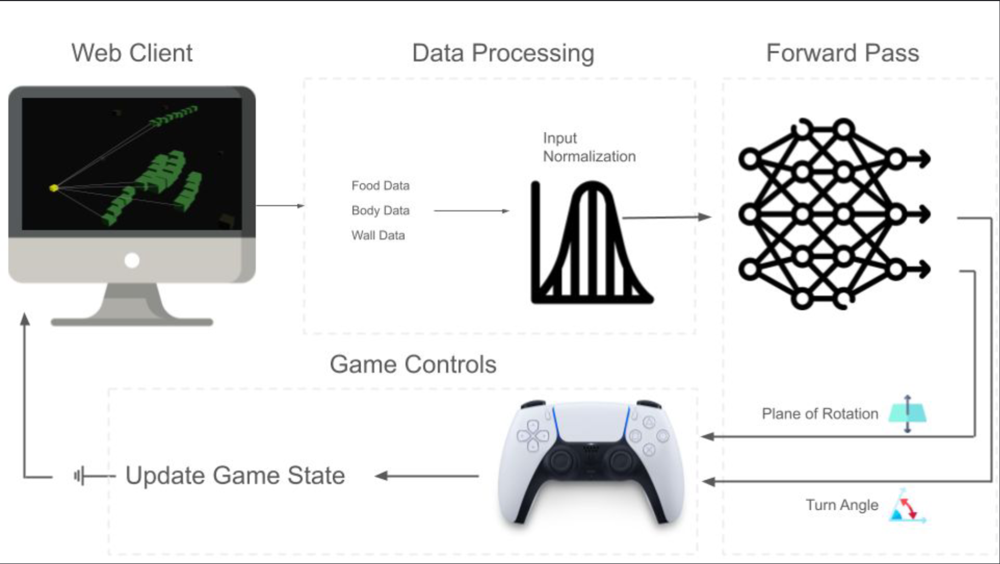

<a href="Blake CSM 2025 Poster.pdf" target="_blank">
    </img>
    </img>
</a>

<a href="Daniel CSM 2025 Poster.pdf" target="_blank">
    </img>
</a>

<a href="Edward CSM 2025 Poster.pdf" target="_blank">
    </img>
</a>

<a href="Jenna CSM 2025 Poster.pdf" target="_blank">
    </img>
</a>

<a href="Jenna ISBI Poster.pdf" target="_blank">
    </img>
</a>

<a href="Kenichi Rami CSM 2025 Poster.pdf" target="_blank">
    </img>
</a>

<a href="Omama Overrview.pdf" target="_blank">
    </img>
</a>

<a href="Outlier Detection for Mammograms.pdf" target="_blank">
    </img>
</a>

<a href="SangHyuk CSM 2025 Poster.pdf" target="_blank">
    </img>
</a>

<a href="Simple 2-Step Process for Removing Unwanted Images in Large Mammography Dataset.pdf" target="_blank">
    </img>
</a>